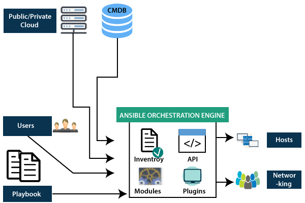

# Ansible

> Ansible is an open-source IT engine that automates application deployment, cloud provisioning, intra service orchestration, and other IT tools.

> Ansible is easy to deploy because it does not use any agents or custom security infrastructure on the client-side, and by pushing modules to the clients. These modules are executed locally on the client-side, and the output is pushed back to the Ansible server.

> It can easily connect to clients using SSH-Keys, simplifying though the whole process. Client details, such as hostnames or IP addresses and SSH ports, are stored in the files, which are called inventory files. If you created an inventory file and populated it, then Ansible can use it.

> Ansible uses the playbook to describe automation jobs, and playbook, which uses simple language, i.e., YAML. YAML is a human-readable data serialization language & commonly used for configuration files, but it can be used in many applications where data is being stored.

> Ansible pushes small programs after connecting to your nodes which are known as "Ansible Modules". Ansible runs that module on your nodes and removes them when finished. Ansible manages the inventory in simple text files (These are the host's files). Ansible uses the host file where one can group the hosts and can control the actions on a specific group in the playbooks.

# Why Use Ansible

> Ansible is free to use by everyone.

> It is very secure due to its agentless capabilities and open SSH security features.

> Ansible does not need any special system administrator skills to install and use it.

> Ansible has a smooth learning curve determined by the comprehensive documentation and easy to learn structure and configuration.

> Its modularity regarding plugins, inventories, modules, and playbooks make Ansible perfect companion orchestrate large environments.

# Ansible History

> Michael DeHaan developed Ansible, and the Ansible project began in February 2012.

> The creator of Cobbler and Func is also the controller of the Fedora Unified network.

> RedHat acquired the Ansible tool in 2015.

> Ansible is included as part of the Fedora distribution of the Linux.

> Ansible is also available for RedHat Enterprise Linux, Debian, CentOS, Oracle Linux, and Scientific Linux via Extra Packages for Enterprise Linux (EPEL) and Ubuntu as well as for other operating systems.

# **Prerequisite**

> Hands-on experience with running commands into a Linux shell

---

# Ansible Workflow

> Ansible works by connecting to your nodes and pushing out a small program called Ansible modules to them. Then Ansible executed these modules and removed them after finished. The library of modules can reside on any machine, and there are no daemons, servers, or databases required.

> In the above image, the Management Node is the controlling node that controls the entire execution of the playbook. The inventory file provides the list of hosts where the Ansible modules need to be run. The Management Node makes an SSH connection and executes the small modules on the host's machine and install the software.

> Ansible removes the modules once those are installed so expertly. It connects to the host machine executes the instructions, and if it is successfully installed, then remove that code in which one was copied on the host machine.

## Terms used in Ansible

<table border="2">
  <thead >
    <tr>
      <th >Terms</th>
      <th>Explanation</th>
    </tr>
  </thead>
  <tbody>
    <tr>
      <td>Ansible Server</td>
      <td>
        It is a machine where Ansible is installed and from which all tasks and
        playbooks will be executed.
      </td>
    </tr>
    <tr>
      <td>Modules</td>
      <td>
        The module is a command or set of similar commands which is executed on
        the client-side.
      </td>
    </tr>
    <tr>
      <td>Task</td>
      <td>
        A task is a section which consists of a single procedure to be
        completed.
      </td>
    </tr>
    <tr>
      <td>Role</td>
      <td>
        It is a way of organizing tasks and related files to be later called in
        a playbook.
      </td>
    </tr>
    <tr>
      <td>Fact</td>
      <td>
        The information fetched from the client system from the global variables
        with the gather facts operation.
      </td>
    </tr>
    <tr>
      <td>Inventory</td>
      <td>A file containing the data regarding the Ansible client-server.</td>
    </tr>
    <tr>
      <td>Play</td>
      <td>
        It is the execution of the playbook. In simple word, a play is
        combination of multiple tasks.
      </td>
    </tr>
    <tr>
      <td>Handler</td>
      <td>The task is called only if a notifier is present.</td>
    </tr>
    <tr>
      <td>Notifier</td>
      <td>
        The section attributed to a task which calls a handler if the output is
        changed.
      </td>
    </tr>
    <tr>
      <td>Tag</td>
      <td>
        It is a name set to a task that can be used later on to issue just that
        specific task or group of jobs.
      </td>
    </tr>
  </tbody>
</table>

# Ansible Architecture 
> The Ansible orchestration engine interacts with a user who is writing the Ansible playbook to execute the Ansible orchestration and interact along with the services of private or public cloud and configuration management database.

> **Orchestration** allows you to define your infrastructure once and use it wherever and however you need.

## Inventory
> Inventory is lists of nodes or hosts having their IP addresses, databases, servers, etc. which are need to be managed.

## API's
> The Ansible API's works as the transport for the public or private cloud services.

## Modules
> Ansible connected the nodes and spread out the Ansible modules programs. Ansible executes the modules and removed after finished. These modules can reside on any machine; no database or servers are required here. You can work with the chose text editor or a terminal or version control system to keep track of the changes in the content.

## Plugins
> Plugins is a piece of code that expends the core functionality of Ansible. There are many useful plugins, and you also can write your own.

## Playbooks
> Playbooks consist of your written code, and they are written in YAML format, which describes the tasks and executes through the Ansible. Also, you can launch the tasks synchronously and asynchronously with playbooks.

## Hosts
> In the Ansible architecture, hosts are the node systems, which are automated by Ansible, and any machine such as RedHat, Linux, Windows, etc.

## Networking
> Ansible is used to automate different networks, and it uses the simple, secure, and powerful agentless automation framework for IT operations and development. It uses a type of data model which separated from the Ansible automation engine that spans the different hardware quite easily.

## Cloud
> A cloud is a network of remote servers on which you can store, manage, and process the data. These servers are hosted on the internet and storing the data remotely rather than the local server. It just launches the resources and instances on the cloud, connect them to the servers, and you have good knowledge of operating your tasks remotely.

## CMDB
> CMDB is a type of repository which acts as a data warehouse for the IT installations.